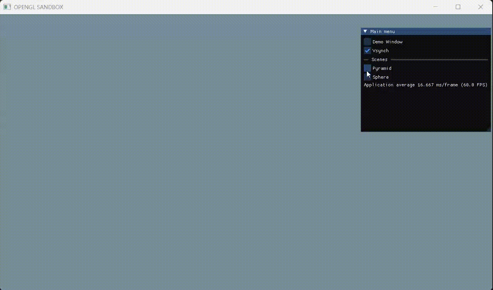

# OpenGL Sandbox

This project provides a simple OpenGL-based sandbox designed to simplify the process of building mini projects using OpenGL. It includes core utility classes like a `Shader` class, `Texture` class, and a Work-In-Progress `Framebuffer` class. The sandbox supports multiple scenes, allowing switching between different projects without having to rewrite boilerplate code each time.

The engine uses ImGUI for creating menus to interact with scenes, making it easier to experiment with scene settings.

A demo of the sandbox in action:

